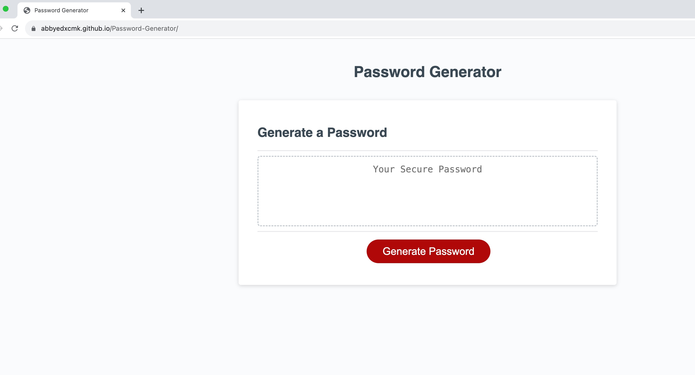

# Module 5 Challenge: Password Generator

[Link to Deployed page](https://abbyedxcmk.github.io/Password-Generator/)

## Overview

This week’s challenge required a creation of an application that an employee can use to generate a random password based on criteria they’ve selected by modifying starter code. This app should run in the browser, and should feature dynamically updated HTML and CSS powered by JavaScript code written by the developer. It should have a clean and polished user interface that is responsive, ensuring that it adapts to multiple screen sizes.

The password can include special characters: [list of Password Special Characters from the OWASP Foundation](https://www.owasp.org/index.php/Password_special_characters).

## Instructions for the developer

* Generate a password when the button is clicked
  * Present a series of prompts for password criteria
    * Length of password
      * At least 8 characters but no more than 128.
    * Character types
      * Lowercase
      * Uppercase
      * Numeric
      * Special characters ($@%&*, etc)
  * Code should validate for each input and at least one character type should be selected
  * Once prompts are answered then the password should be generated and displayed in an alert or written to the page

## Deployment details

You are required to submit the following for review:

* [The URL of the deployed application](https://abbyedxcmk.github.io/Password-Generator/)

* [The URL of the GitHub repository.](https://github.com/abbyedxcmk/Password-Generator)

---

© 2023 edX Boot Camps LLC. Confidential and Proprietary. All Rights Reserved.
